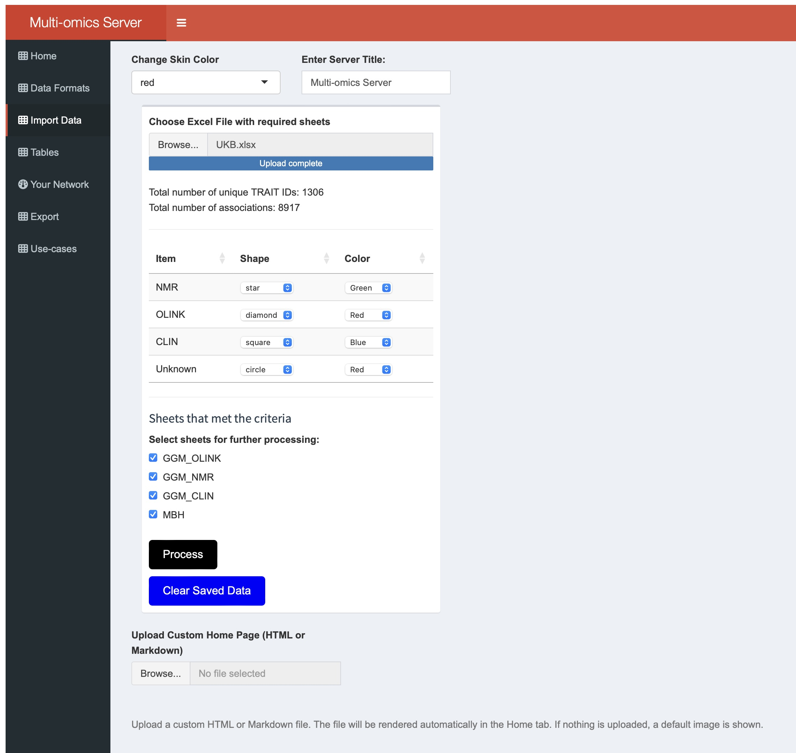

# Multi-omics Network Explorer
This Shiny application provides a flexible, user-friendly interface for visualizing custom datasets. It was originally developed for a specific research study [The Molecular Human](http://www.metabolomix.com/comics/) to explore biological networks and associations. The current version generalizes the core functionality and introduces several enhancements, allowing users to upload and explore their own data with minimal setup.

## What's New in This Version?

The app has evolved from a study-specific visualization tool to a broad range of data types and analyses. Key improvements include:

🗂 Custom Data Upload: Users can now upload their own Excel file for visualization without modifying the code.<br>
📈 Dynamic Network Rendering: Network visualization dynamically reflects user-provided data, with customizable node attributes like shape, size, and color.<br>
🔍 Interactive Exploration: Integrated filtering, zooming, and focus tools to explore node-level and edge-level relationships.<br>
💾 Session-aware Custom Settings: User-defined settings (e.g., layout, color mapping, node filtering) persist across interactions during a session.<br>

## How to Use

### 1.   Input Data Format
   - Your Association dataset must contain at minimum:
     - A sheet with column headers <b>TRAITID1</b>, and <b>TRAITID2</b>.
     - Optional column headers: <b>PVALUE</b>, <b>BETA</b> or <b>COR</b>. If missing, default values with be used: PVALUE = 1 and BETA = 1.
        - Your Node attributes must contain:
        - TRAITID, SHORTNAME, PLAT.    
        PLAT indicates the platform ((e.g., OLINK, GWAS, EWAS, MBS) and defines node shape and color.

Note: Multiple association sheets are allowed. Only one annotation sheet is permitted.

### 2.   Basic Navigation
   - Start from the Home page. To customize it, go to Import Data > Upload Custom Home Page (HTML or Markdown).
   - Upload Data
      - Use the Import Data tab to upload your Excel file. A summary will display:
         - Total number of associations
         - Number of traits
         - Platforms identified

### 3.   Customize Network
Users can:
   - Assign shapes and colors to platforms.
   - Select/deselect sheets for processing.
   - Clicking "Process" will populate the Table tab and enable network visualization.

### 4.   Selecting Pairwise Associations
   - Under the Tables tab, browse and search associations across tabs like GWAS, EWAS, RWAS, MBH, GGM, GENO, CATA, STAT.
   - Click a row, then press "Focus network on selection" to view connected traits.
     
## 4.   Interact with the Visualization      
   - Explore the network graph.
   - Adjust "Max Nodes" dropdown (e.g., select 1 to show first-degree neighbors).
   - Hover over nodes/edges to view properties.
   - Drag nodes to rearrange the layout.
   - Click a node to show connected traits in the table below.


## Running the server locally in RStudio:
All files required to run the app locally using RStudio are in this GitHub repository. Start-up rstudio and then launch app.R as a shiny app.

Requirements
You must have:
R installed
RStudio for an easier workflow
The following R libraries installed in RStudio:

```bash
install.packages(c("shiny", "shinyjs", "shinydashboard", "readxl", "dplyr", "tidyr", "visNetwork", "DT", "shinyWidgets", "igraph","rlang","writexl","digest"))
```
## Usage
Run the App:
Open RStudio in the projecr folder and run:
```bash
shiny:runApp("app)
```
or, if you open app/app.R, click Run App in RStudio.
The app will launch in your browser at:
```bash
http://localhost:3838
```
## Running via a web server
The app is available following this link: http://128.84.40.245 

## Running the Dockerized Shiny App
1. Pull the image from GitHub Container Registry:
   ```bash
   docker pull ghcr.io/th206/multiomicserver:latest
   ```
2. Run the container:
   ```bash
   docker run --rm -p 3838:3838 ghcr.io/th206/multiomicserver:latest
   ```
   Navigate to your browser and open the following page: http://localhost:3838

Here is a screenshots of the server:



